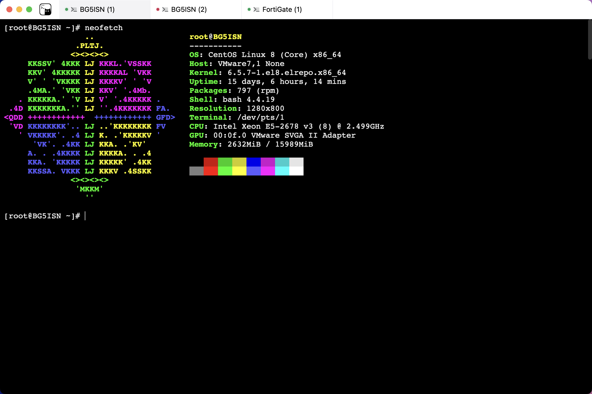
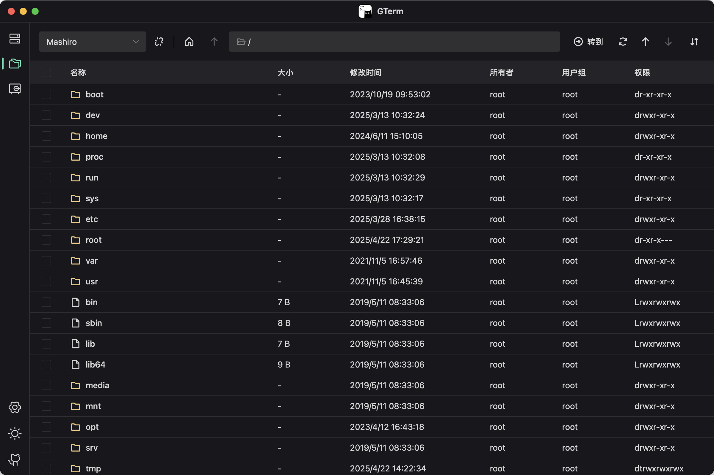
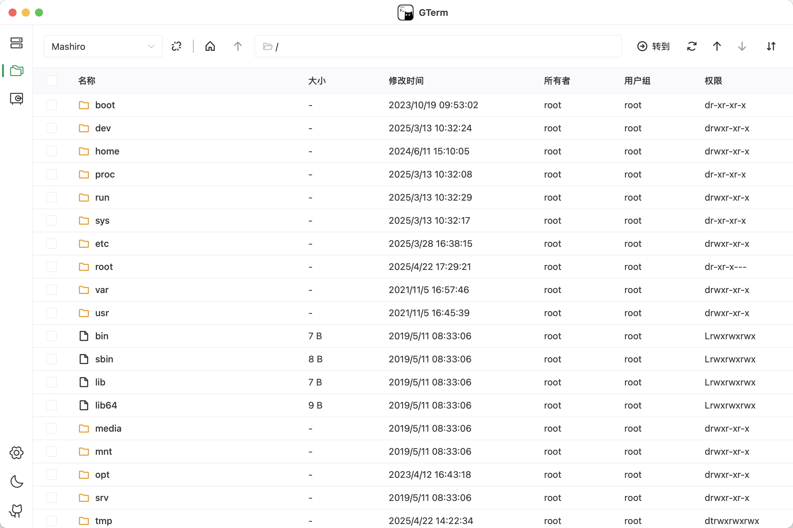
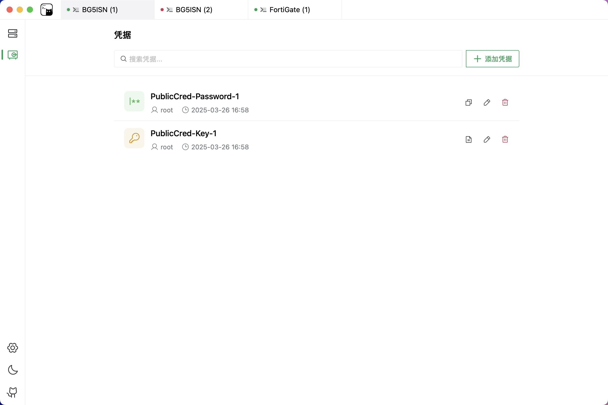
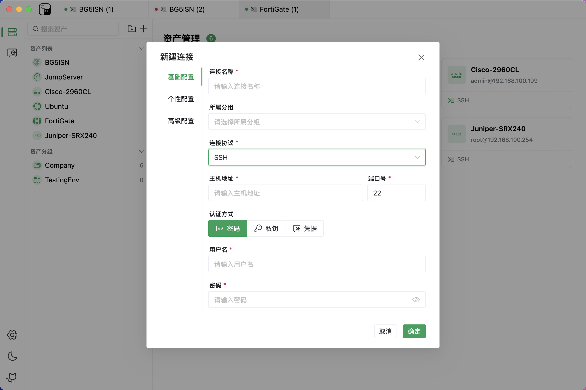
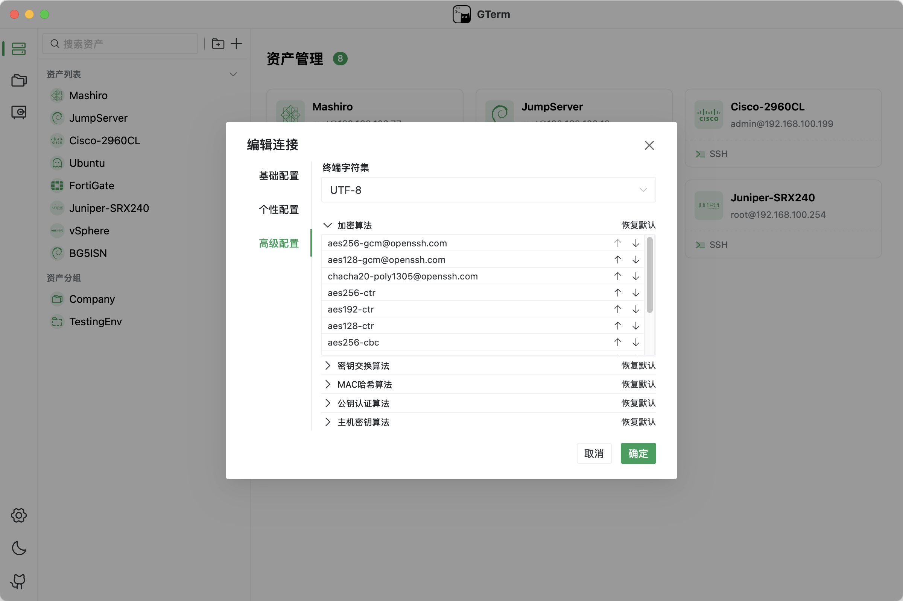
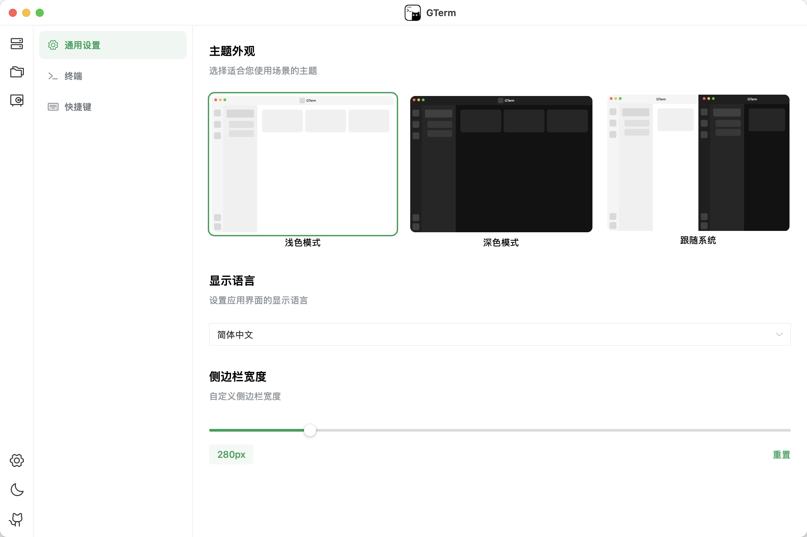
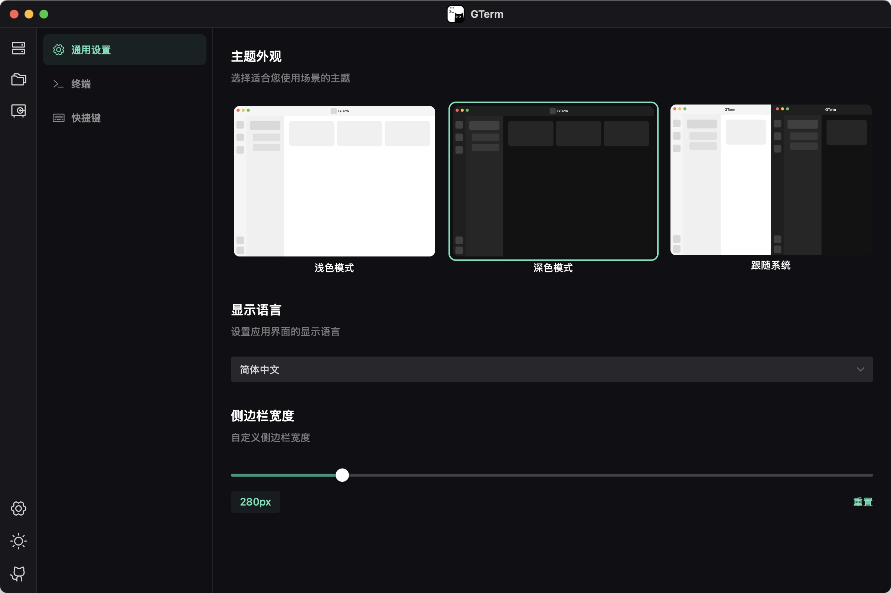

# GTerm

A terminal tool developed with Wails + Vue3 + TypeScript.

This is the first development preview version of GTerm. Due to my full-time work commitments, I can only dedicate limited time to this project. Development will progress gradually, and currently, it only implements basic functionality. There are still many bugs and issues that need to be addressed. If you're interested in contributing to the project, pull requests are welcome!

## Screenshots

<table>
<tr>
<td></td>
<td></td>
</tr>
<tr>
<td></td>
<td></td>
</tr>
<tr>
<td></td>
<td></td>
</tr>
<tr>
<td></td>
<td></td>
</tr>
<tr>
<td></td>
<td></td>
</tr>
<tr>
<td></td>
<td></td>
</tr>
</table>

# Supported Platforms

- Windows 10/11 AMD64/ARM64
- MacOS 10.13+ AMD64
- MacOS 11.0+ ARM64
- Linux AMD64/ARM64

## Dependencies

- Go 1.24.1
- PNPM (Node 18+)
- Wails CLI v2.10.1

## Development

```bash
wails dev
```

## Building

```bash
wails build
```
